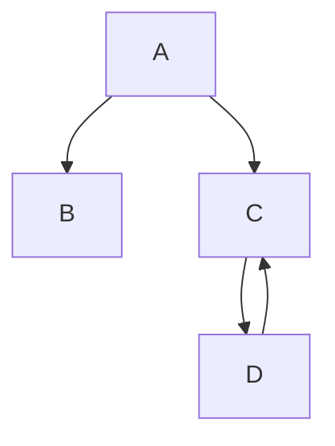

# spself
<!-- 
<picture>
  <source media="(prefers-color-scheme: dark)" srcset="https://user-images.githubusercontent.com/25423296/163456776-7f95b81a-f1ed-45f7-b7ab-8fa810d529fa.png">
  
  
</picture >-->   

<details>
<summary>My top languages</summary>
  
  
| Rank | THING-TO-RANK |
|:---|-----------|
|  1|    java           |
|  2|               |
| 3|               |

  
  ---
  >sp

</details>


# **The largest heading**
## *The second largest heading*
###### The smallest heading


Some basic Git commands are:
```
git status
git add
git commit
```


* sp
+ ps
  + ps


<details><summary>CLICK ME</summary>
<p>

#### We can hide anything, even code!

```ruby
   puts "Hello World"
```

</p>
</details>

```
function test() {
  console.log("notice the blank line before this function?");
}
```

Flow chart


map
```geojson
{
  "type": "FeatureCollection",
  "features": [
    {
      "type": "Feature",
      "id": 1,
      "properties": {
        "ID": 0
      },
      "geometry": {
        "type": "Polygon",
        "coordinates": [
          [
              [-90,35],
              [-90,30],
              [-85,30],
              [-85,35],
              [-90,35]
          ]
        ]
      }
    }
  ]
}
```
Math 

$\sqrt{3x-1}+(1+x)^2$

```math
\sqrt{3}
```

To split <span>$</span>100 in half, we calculate $100/2$


